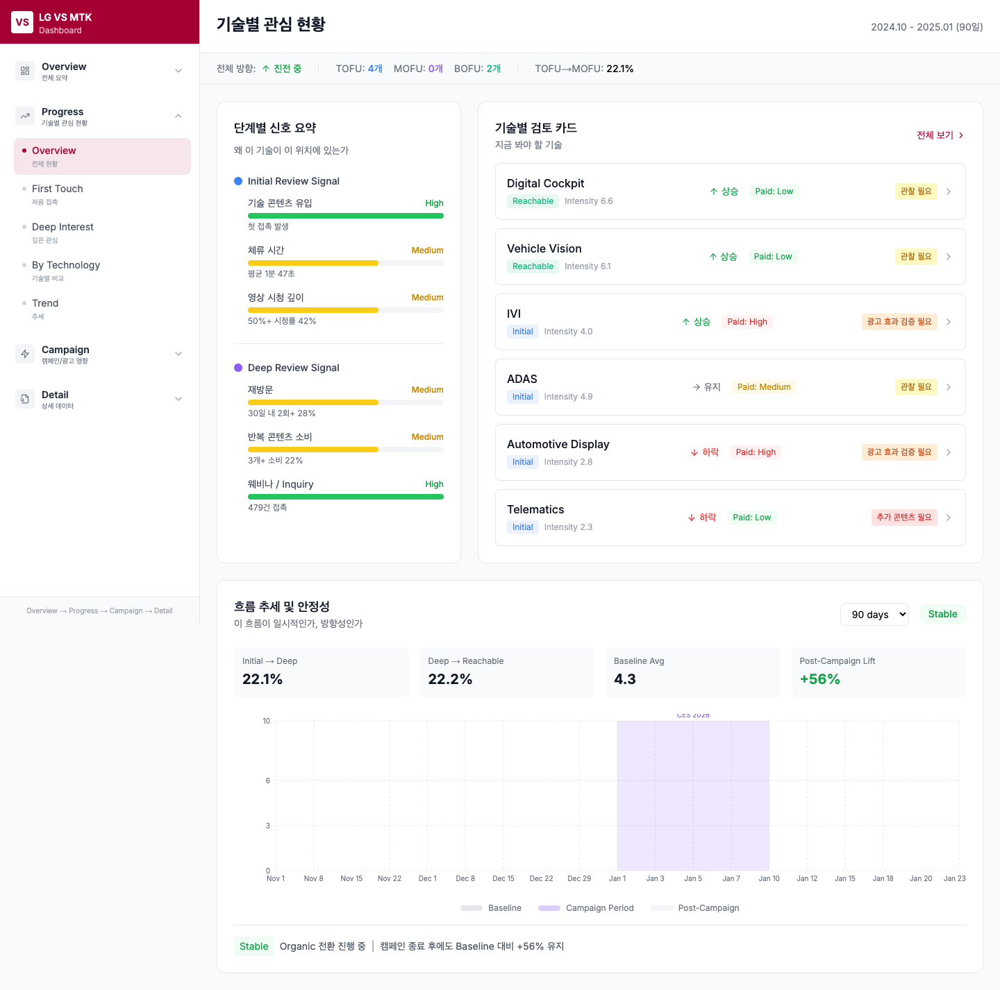
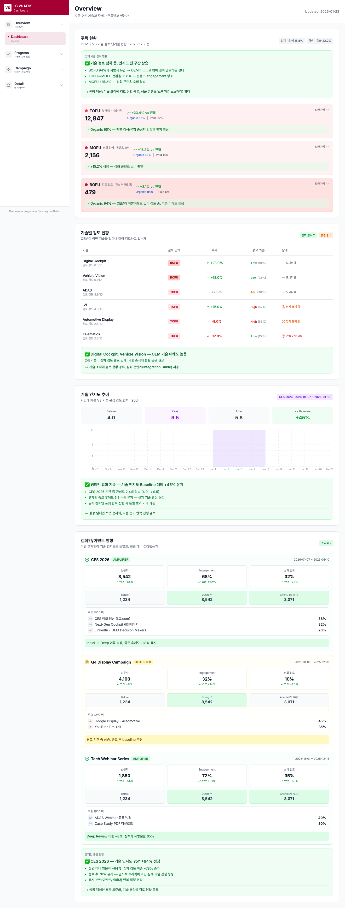
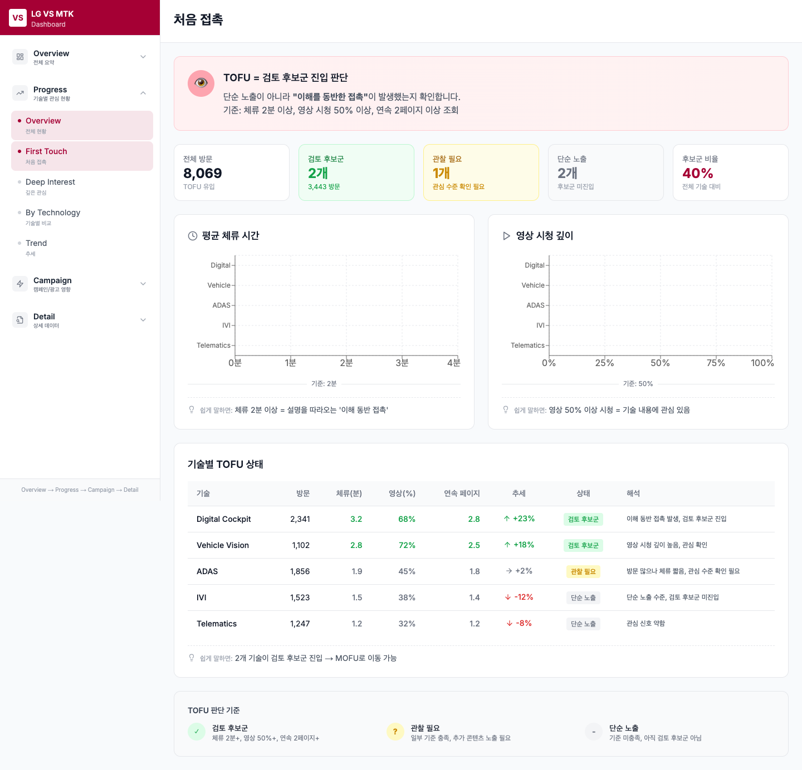
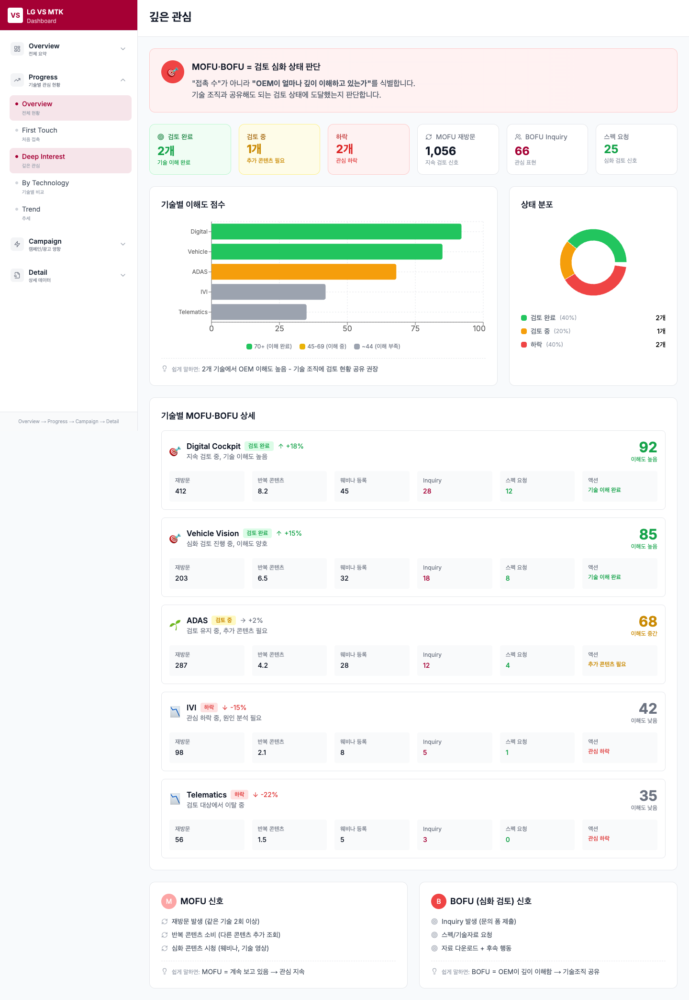
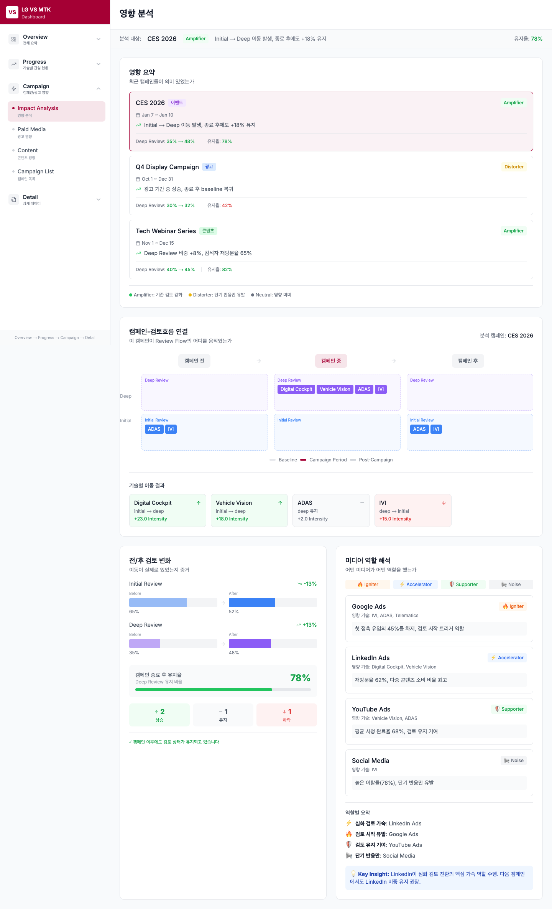
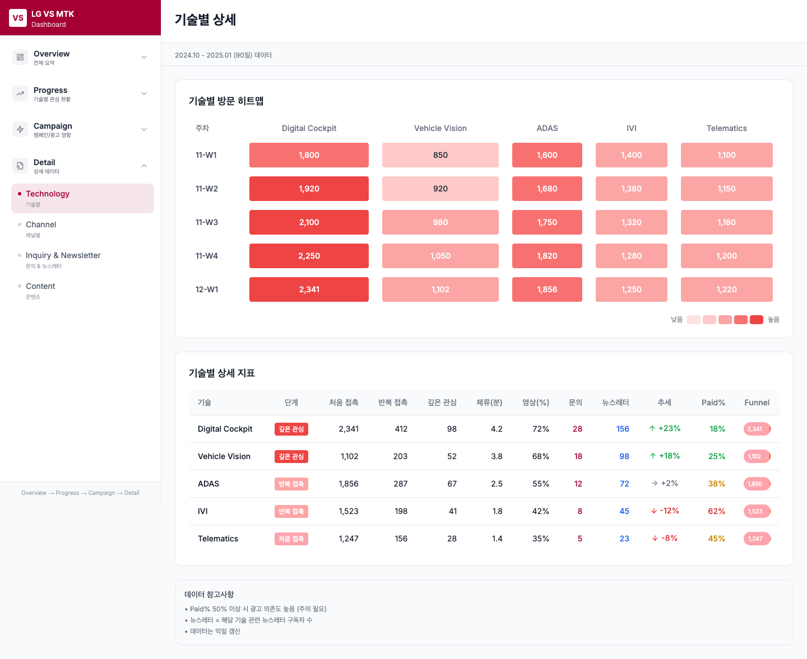
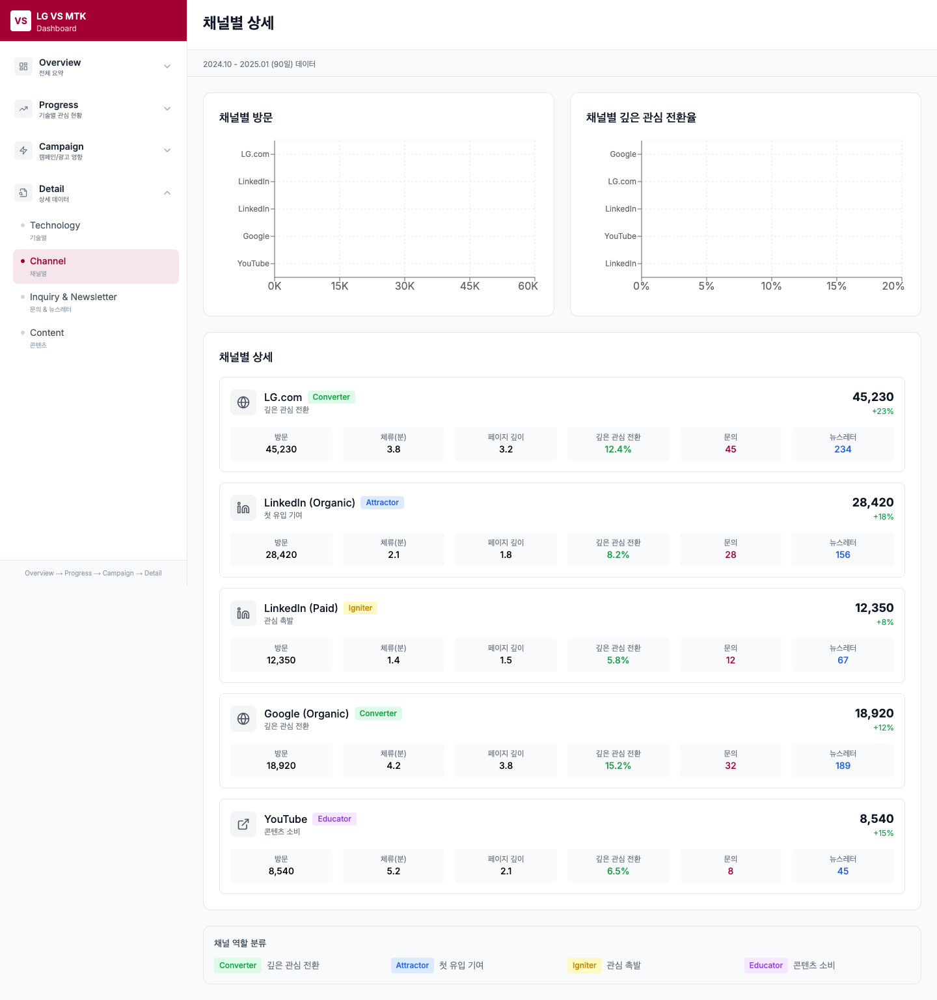
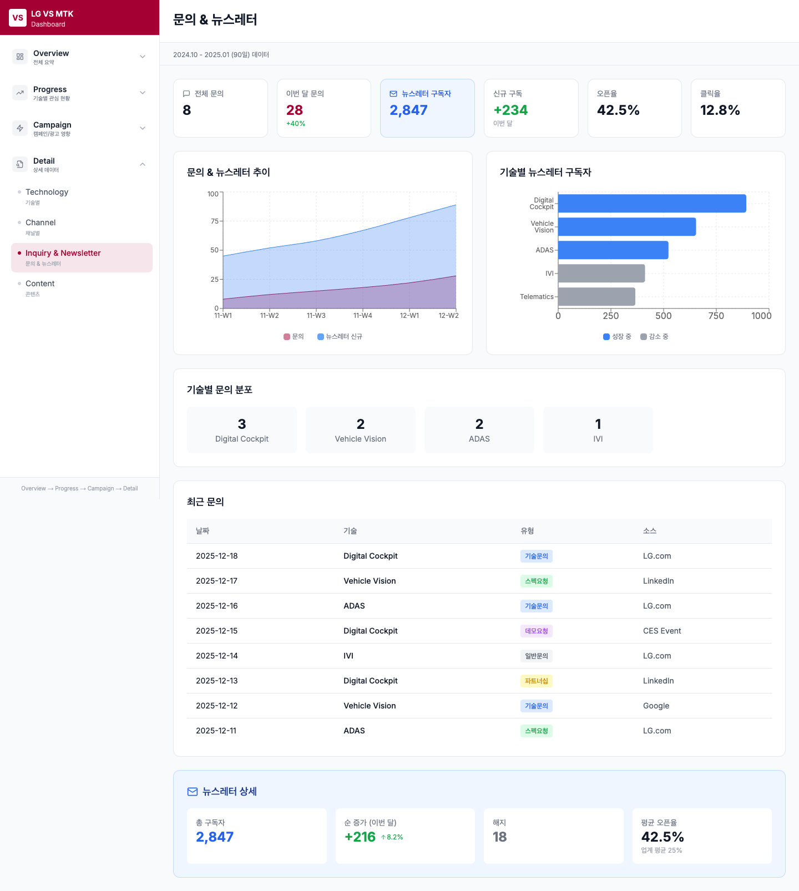
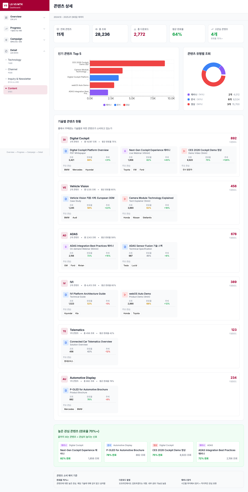

# LG VS 디지털 대시보드 전략 문서

## 데이터는 그대로, 판단 구조를 바꾼다

---

## 1. 대시보드 재설계의 배경과 원칙

### 1.1 Key Message

> VS 디지털 대시보드는 새로운 데이터를 추가하는 문제가 아니라,  
> 이미 수집 가능한 데이터를 **'기술 검토 상태와 이동'** 관점으로 재구성하는 문제다.

---

### 1.2 재설계의 출발점: 현실적 전제

#### 현재 수집 가능한 데이터
| 소스 | 수집 항목 | 활용 가능 범위 |
|------|----------|---------------|
| **LG.com** | 기술/캠페인/인사이트 페이지 방문, 체류 시간, 다운로드 | 관심 깊이 측정 |
| **LinkedIn** | 기술 관련 콘텐츠 클릭, Engagement (Organic/Paid) | 인지 및 관심 측정 |
| **YouTube** | 기술 설명 영상 조회, 시청 깊이(%) | 이해 수준 측정 |
| **Paid Media** | 광고 노출, 클릭, 유입 경로 | 유입 트리거 역할 |
| **Webinar** | 등록, 참석, 시청 완료율 | 심화 관심 측정 |
| **Inquiry** | 문의 폼 제출, 스펙 요청, 뉴스레터 구독 | 구체적 의도 측정 |
| **OEM 구분** | OEM / Non-OEM 트래픽 분리 | 타겟 정확도 향상 |

#### 포함되지 않는 데이터
- CRM 데이터 (고객 정보, 상담 이력)
- 계약 데이터 (RFQ, RFP, 수주)
- 매출 데이터 (실적, 파이프라인)
- 오프라인 이벤트 직접 측정 (부스 방문자 등)

**→ 추가 데이터 수집 없이, 현재 데이터만으로 설계되어야 함**

---

### 1.3 기존 대시보드의 한계

#### 데이터는 있지만 판단이 어려운 구조

| 기존 구조 | 문제점 |
|----------|--------|
| 채널별 KPI 나열 | LinkedIn 클릭 수, YouTube 조회 수... 그래서 뭘 해야 하는가? |
| 시계열 추이 | 이번 달 20% 증가... 그게 초기 검토인가, 심화 검토인가? |
| 캠페인 성과 요약 | 노출 100만, 클릭 5만... 검토 단계는 이동했는가? |

#### 답하지 못하는 질문들
- 이 데이터가 **초기 검토**인지, **심화 검토**인지 구분되는가?
- 기술 검토가 **진행 중**인지, **정체 상태**인지 알 수 있는가?
- 결과적으로 **수주 가능성**을 판단할 수 있는가?

#### 결과
- "무엇이 늘었다/줄었다"는 보이지만
- "그래서 어떻게 해야 하는가"는 보이지 않음
- **수주 가능성 판단 불가**

---

### 1.4 대시보드 재설계의 핵심 원칙

| 기존 접근 | 새로운 접근 |
|----------|------------|
| 새로운 데이터 수집 | 기존 데이터를 **기술 검토 단계 기준**으로 재배치 |
| 채널 중심 정렬 | **상태·단계 중심** 정렬 |
| KPI 나열 | **검토 흐름 해석** |
| 단기 수치 강조 | **방향성과 지속성** 강조 |
| "잘했다/못했다" 평가 | "어디에 있고, 어디로 가는가" 판단 |

---

### 1.5 새 대시보드가 답해야 할 질문

모든 화면은 아래 질문 중 하나에 답하도록 설계된다.

| # | 핵심 질문 | 의사결정 연결 |
|---|----------|--------------|
| 1 | 기술 검토는 초기(TOFU)인가, 심화(MOFU/BOFU)인가? | 마케팅 메시지 수준 결정 |
| 2 | 어떤 기술·주제가 검토 대상에서 살아남고 있는가? | 콘텐츠/캠페인 우선순위 |
| 3 | 캠페인·이벤트가 검토 단계를 실제로 이동시켰는가? | 투자 효과 판단 |
| 4 | 기술 조직이 개입해도 되는 시점에 도달했는가? | 협업 타이밍 결정 |

---

## 2. 대시보드 전체 구조 (Page Architecture)



### 2.1 구조 개요

```
┌─────────────────────────────────────────────────────────────────┐
│                    1. Executive Overview                         │
│         전체 기술 검토 흐름 요약 · 상태 이동 방향 판단            │
└─────────────────────────────────────────────────────────────────┘
                              │
          ┌───────────────────┼───────────────────┐
          ▼                   ▼                   ▼
┌─────────────────┐ ┌─────────────────┐ ┌─────────────────┐
│   2. TOFU       │ │ 3. MOFU/BOFU    │ │ 4. 캠페인 영향  │
│   초기 검토     │ │ 심화 검토       │ │ 분석            │
│   현황          │ │ 및 접촉 가능    │ │                 │
└─────────────────┘ └─────────────────┘ └─────────────────┘
                              │
                              ▼
               ┌─────────────────────────┐
               │ 5. 채널·콘텐츠 보조 분석 │
               │    (Detail / Evidence)   │
               └─────────────────────────┘
```

---

### 2.2 각 화면의 역할

#### 1) Executive Overview
- **목적**: 임원·의사결정자가 상세 리포트 없이 현재 상황을 즉시 이해
- **핵심 질문**: "기술 검토가 진전되고 있는가?"
- **구성 요소**:
  - 기술 검토 단계 분포 (TOFU/MOFU/BOFU 비중)
  - 전 기간 대비 변화 방향 (진전/정체/후퇴)
  - 검토 강도 Top 기술/테마
  - 최근 30/60/90일 트렌드 스냅샷
  - 캠페인·이벤트 영향 요약

#### 2) 초기 기술 검토 대시보드 (TOFU)
- **목적**: VS 기술이 OEM의 '검토 후보군'에 진입했는지 판단
- **핵심 질문**: "설명을 따라오는 '이해 동반 접촉'이 발생했는가?"
- **구성 요소**:
  - 기술별 접촉 발생 현황
  - 체류 시간, 영상 시청 깊이
  - 복수 접점 발생 여부
  - 검토 후보군 리스트

#### 3) 심화 기술 검토 대시보드 (MOFU/BOFU)
- **목적**: 검토가 지속되며 접촉 가능 상태에 도달했는지 판단
- **핵심 질문**: "접촉해도 되는 기술인가?"
- **구성 요소**:
  - 기술별 상태 구분 (유지/강화/이탈)
  - 재방문, 반복 콘텐츠 소비 현황
  - Inquiry, 스펙 요청 발생
  - BOFU 후보 기술 식별

#### 4) 캠페인·이벤트 영향 분석
- **목적**: 캠페인이 검토 단계를 실제로 이동시켰는지 평가
- **핵심 질문**: "단기 반응인가, 지속 검토로 이어졌는가?"
- **구성 요소**:
  - 캠페인 전/중/후 단계 분포 변화
  - 기술별 단계 이동 맵
  - 종료 후 유지 여부
  - 영향 분류 (Amplifier/Distorter/Neutral)

#### 5) 채널·콘텐츠 보조 분석
- **목적**: 상위 화면 판단의 근거 데이터 확인
- **핵심 질문**: "왜 그런 판단이 나왔는가?"
- **구성 요소**:
  - 채널별 역할 비교 (Converter/Attractor/Igniter)
  - 콘텐츠별 소비 현황
  - 상세 지표 테이블

---

## 3. Executive Overview 상세



### 3.1 Key Message

> Executive Overview는 채널 성과 요약이 아니라,  
> VS 기술 검토가 **초기 → 심화 → 접촉 가능 상태**로 이동하고 있는지를 한눈에 판단하는 화면이다.

---

### 3.2 Overview의 역할

| 기존 Executive Dashboard | 새로운 Executive Overview |
|-------------------------|--------------------------|
| "이번 달 클릭 수는?" | "기술 검토가 진전되고 있는가?" |
| 채널별 KPI 요약 | 검토 단계별 분포 |
| 전월 대비 증감률 | 검토 상태 이동 방향 |
| Top 콘텐츠 순위 | 지속 검토 중인 핵심 기술 |

---

### 3.3 반드시 답해야 할 핵심 질문

| 질문 | 답변 형식 | 활용 |
|------|----------|------|
| 현재 기술 검토는 어느 단계에 머물러 있는가? | TOFU 60% / MOFU 30% / BOFU 10% | 전체 파이프라인 건강도 |
| 전 기간 대비 검토 상태는 이동했는가? | 진전 ↑ / 정체 → / 후퇴 ↓ | 전략 조정 필요 여부 |
| 어떤 기술이 검토 대상에서 살아남고 있는가? | Digital Cockpit, Vehicle Vision | 콘텐츠/캠페인 집중 대상 |
| 최근 캠페인이 상태 변화에 영향을 주었는가? | CES: Amplifier, LinkedIn Ads: Neutral | 투자 효과 판단 |

---

### 3.4 핵심 구성 요소

#### ① 기술 검토 단계 분포 요약
- TOFU / MOFU / BOFU 비중 (도넛 차트 또는 퍼널)
- 전 기간 대비 변화 방향 (화살표)
- Paid 기여 비율 (서브 레이어)

#### ② 검토 강도 Top 기술/테마
- 반복 소비·재방문 기준 정렬
- "가장 많이 본 기술" ❌
- "계속 보고 있는 기술" ⭕
- 기술별 추세 (↑ 상승 / → 유지 / ↓ 하락)

#### ③ 최근 트렌드 스냅샷
- 30/60/90일 기준 선택 가능
- 단기 스파이크가 아닌 **방향성** 중심
- 캠페인 기간 오버레이

#### ④ 캠페인·이벤트 영향 요약
- 최근 1~2개 주요 캠페인/이벤트
- 단계 이동 여부만 표시
- 상세는 하위 페이지에서 확인

---

### 3.5 이 대시보드의 의미

| 하는 것 | 하지 않는 것 |
|--------|------------|
| 판단 기준 제공 | 숫자 요약 |
| "지금 어디에 있고, 어디로 가고 있는가" | "잘 됐다/안 됐다" |
| 다음 액션 방향 제시 | 자동 추천/인사이트 |

---

## 4. TOFU 대시보드 – 초기 기술 검토 현황



### 4.1 Key Message

> TOFU 대시보드는 VS 기술이 단순 노출을 넘어  
> **OEM의 검토 후보군으로 인식되기 시작했는지**를 판단하는 화면이다.

---

### 4.2 대시보드가 답해야 할 질문

| 질문 | 판단 기준 | 데이터 소스 |
|------|----------|------------|
| 어떤 기술이 실제로 접촉되었는가? | 유입 발생 여부 | LG.com, LinkedIn |
| 설명을 따라오는 '이해 동반 접촉'이 발생했는가? | 체류 3분+, 영상 50%+ | LG.com, YouTube |
| 검토 후보군에 들어온 기술은 무엇인가? | 복수 접점 발생 | 크로스 채널 |

---

### 4.3 활용 데이터 범위

| 소스 | 활용 방식 |
|------|----------|
| LG.com | 방문, 체류 시간, 연속 조회 |
| LinkedIn | 기술 콘텐츠 클릭, Engagement |
| YouTube | 기술 설명 영상 시청 깊이 |
| Paid Media | 유입 트리거로서의 역할만 반영 (KPI 아님) |

---

### 4.4 핵심 지표

| 지표 | 의미 | 기준 |
|------|------|------|
| 기술 콘텐츠 유입 발생 여부 | 인지 시작 | 1회 이상 |
| 평균 체류 시간 | 관심 깊이 | 3분+ = 의미 있음 |
| 영상 50%+ 시청 비율 | 이해 동반 여부 | 50% 이상 |
| 단일 기술에 대한 복수 접점 | 지속 관심 | 2채널 이상 |

**※ 단순 노출·클릭 수는 보조 지표로만 활용**

---

### 4.5 출력 관점

| 정렬 기준 | 강조 포인트 |
|----------|------------|
| 기술/솔루션 단위 | "많이 노출된 기술" ❌ |
| 이해 동반 접촉 기준 | "이해를 동반한 접촉이 발생한 기술" ⭕ |
| 검토 후보군 리스트화 | 초기 검토 풀(pool) 정의 |

---

### 4.6 이 대시보드의 역할

1. **초기 검토 풀(pool) 정의**
   - 인지가 시작된 기술 목록
   - 마케팅 집중 대상 후보

2. **심화 검토 가능성 판단**
   - 이해 동반 접촉 발생 시 → MOFU 이동 가능성
   - 단순 노출만 → 추가 콘텐츠/캠페인 필요

3. **콘텐츠 전략 피드백**
   - 체류 시간이 짧은 기술 → 콘텐츠 개선 필요
   - 영상 이탈 지점 분석 → 메시지 조정

---

## 5. MOFU·BOFU 대시보드 – 심화 검토 및 접촉 가능 상태



### 5.1 Key Message

> MOFU·BOFU 대시보드는 VS 기술이 지속적으로 검토되며,  
> **기술 조직이 개입해도 무리가 없는 상태에 도달했는지**를 판단하는 화면이다.

---

### 5.2 대시보드가 답해야 할 질문

| 질문 | 판단 기준 | 의미 |
|------|----------|------|
| 어떤 기술이 검토 대상에서 계속 살아남고 있는가? | 재방문, 반복 콘텐츠 소비 | 관심 지속 |
| 검토가 일회성이 아닌 지속 상태인가? | 2주 이상 반복 접촉 | 진지한 검토 |
| 접촉이 '자연스럽게 고려되는 단계'에 도달했는가? | Inquiry, 스펙 요청 발생 | 구체적 의도 |

---

### 5.3 MOFU vs BOFU 구분

| 단계 | 정의 | 신호 | 의미 |
|------|------|------|------|
| **MOFU** | 반복 접촉, 심화 탐색 | 재방문, 복수 콘텐츠, 웨비나 등록 | "계속 보고 있음" |
| **BOFU** | 구체적 관심 표현 | Inquiry, 스펙 요청, 자료 다운로드 | "깊이 이해함, 협업 가능" |

---

### 5.4 활용 데이터 범위

| 소스 | MOFU 활용 | BOFU 활용 |
|------|----------|----------|
| LG.com | 재방문, 반복 소비 | 자료 다운로드, 스펙 페이지 |
| YouTube | 심화 콘텐츠 시청, 영상 70%+ | - |
| Webinar | 등록, 참석 | 질문 제출, 후속 자료 요청 |
| Inquiry | - | 문의 폼 제출, 스펙 요청 |
| Newsletter | 구독 | 오픈율, 클릭율 |

---

### 5.5 기술별 상태 구분

| 상태 | 정의 | 신호 | 액션 |
|------|------|------|------|
| **강화 ↑** | 관심 증가 중 | 재방문 증가, 신규 콘텐츠 소비 | 콘텐츠 확대, 기술조직 공유 준비 |
| **유지 →** | 관심 지속 | 일정 수준 유지 | 현 전략 유지 |
| **이탈 ↓** | 관심 하락 | 재방문 감소, 접촉 중단 | 원인 분석, 재관심 유도 |

---

### 5.6 출력 관점

| 정렬 기준 | 강조 포인트 |
|----------|------------|
| 기술별 상태 (강화/유지/이탈) | "접촉 수" ❌ |
| BOFU 후보 기술 식별 | "접촉해도 되는 기술" ⭕ |
| 이해도 점수 (복합 지표) | 기술 조직 공유 우선순위 |

---

### 5.7 이 대시보드의 역할

1. **기술 조직과의 연결 지점 제공**
   - BOFU 진입 기술 → 기술 조직에 현황 공유
   - 콘텐츠 고도화 방향 도출

2. **무리한 접촉 방지**
   - TOFU 단계에서 섣부른 접촉 → 역효과
   - BOFU 단계 확인 후 → 의미 있는 대화 가능

3. **콘텐츠 전략 피드백**
   - MOFU에서 정체 → 심화 콘텐츠 부족
   - BOFU 전환율 낮음 → CTA/Inquiry 경로 개선

---

## 6. 캠페인·이벤트 영향 분석 대시보드



### 6.1 Key Message

> 캠페인 성과는 단기 수치가 아니라,  
> **기술 검토 상태를 다음 단계로 이동시켰는지 여부**로 해석해야 한다.

---

### 6.2 캠페인의 정의

| 구분 | 예시 | 특징 |
|------|------|------|
| **대형 이벤트** | CES, IAA, Tech Expo | 집중 노출, 단기 고강도 |
| **집중 캠페인** | 신기술 런칭, 시즌 캠페인 | 특정 기술 집중 |
| **Always-on** | 상시 콘텐츠, 리타겟팅 | 지속적 노출 (분석 대상 아님) |

---

### 6.3 대시보드가 답해야 할 질문

| 질문 | 분석 방식 | 판단 기준 |
|------|----------|----------|
| 캠페인 전·후 검토 단계가 이동했는가? | Before/After 비교 | 단계 분포 변화 |
| 어떤 기술이 캠페인을 계기로 심화 검토로 진입했는가? | 기술별 이동 맵 | TOFU→MOFU, MOFU→BOFU |
| 단기 반응인지, 지속 검토로 이어졌는가? | 캠페인 종료 후 추적 | 2주 후 유지 여부 |

---

### 6.4 분석 관점

#### 시간축 분석
| 구간 | 분석 내용 |
|------|----------|
| **캠페인 전** | 베이스라인 (기준점) |
| **캠페인 중** | 반응 강도, 유입 패턴 |
| **캠페인 후** | 유지 여부, 이탈 패턴 |

#### 영향 분류
| 분류 | 정의 | 의미 |
|------|------|------|
| **Amplifier** | 기존 검토를 강화 | 좋은 투자 |
| **Accelerator** | 단계 이동 가속 | 매우 좋은 투자 |
| **Distorter** | 단기 반응만 유발 | 효과 재검토 필요 |
| **Neutral** | 영향 미미 | 타겟/메시지 조정 필요 |

---

### 6.5 출력 관점

| 항목 | 표시 방식 |
|------|----------|
| 캠페인별 단계 이동 맵 | 시각적 Before/After |
| 영향 분류 태그 | Amplifier/Distorter/Neutral |
| 기술별 이동 현황 | 테이블 + 화살표 |
| YoY 비교 | 전년 동기 대비 (CES 등) |

---

### 6.6 이 대시보드의 역할

1. **이벤트·캠페인 투자 판단 근거 제공**
   - "노출이 아니라 전환된 판단"을 기준으로 평가
   - ROI가 아닌 **검토 단계 이동**으로 효과 측정

2. **향후 캠페인 전략 수립**
   - 어떤 유형의 캠페인이 효과적인가
   - 어떤 기술에 집중해야 하는가

3. **광고의 역할 재정의**
   - 독립 KPI로 평가 ❌
   - "관심 흐름을 얼마나 증폭/가속했는가"로 해석 ⭕

---

## 7. 채널·콘텐츠 보조 분석

### 7.1 역할

- 상위 화면(Overview, TOFU, MOFU/BOFU, Campaign)의 **판단 근거 확인**
- 전략 수립이 아닌 **팩트 체크** 용도
- 상세 지표 열람 및 검증

### 7.2 화면별 스크린샷

#### 기술별 상세


#### 채널별 상세


#### 문의 & 뉴스레터


#### 콘텐츠 상세


---

### 7.3 구성 요소

| 페이지 | 내용 | 활용 |
|--------|------|------|
| **기술별 상세** | 기술별 방문 히트맵, 상세 지표 | 특정 기술 심층 분석 |
| **채널별 상세** | 채널별 역할 분류, 전환 기여도 | 채널 전략 검토 |
| **문의 & 뉴스레터** | Inquiry 현황, 구독자 추이 | 리드 품질 확인 |
| **콘텐츠 상세** | 콘텐츠별 조회, 완료율 | 콘텐츠 효과 검토 |

---

### 7.4 채널별 역할 정의

| 역할 | 정의 | 예시 채널 |
|------|------|----------|
| **Converter** | 깊은 관심으로 전환 | LG.com, Google Organic |
| **Attractor** | 첫 유입 기여 | LinkedIn Organic |
| **Igniter** | 관심 촉발 | LinkedIn Paid, Google Ads |
| **Educator** | 콘텐츠 소비 | YouTube |

---

## 8. 대시보드 활용 시나리오

### 8.1 Key Message

> 본 대시보드는 마케팅 리포트가 아니라,  
> VS 사업 전반의 판단을 연결하는 **공통 의사결정 언어**다.

---

### 8.2 조직별 활용

#### 마케팅 조직
| 질문 | 대시보드 활용 |
|------|-------------|
| 어떤 기술을 계속 밀 것인가? | TOFU/MOFU 전환율 높은 기술 |
| 어떤 메시지·콘텐츠를 보완할 것인가? | 체류 시간 낮은 콘텐츠 |
| 캠페인 우선순위는? | 단계 이동 효과가 큰 캠페인 유형 |

#### 세일즈 조직
| 질문 | 대시보드 활용 |
|------|-------------|
| 어떤 기술이 이미 충분히 검토되었는가? | BOFU 진입 기술 목록 |
| 접촉 타이밍은 언제인가? | BOFU 전환 시점 |
| 접근 전략 사전 정렬 | 어떤 콘텐츠를 많이 봤는지 확인 |

#### 기술 조직
| 질문 | 대시보드 활용 |
|------|-------------|
| OEM이 무엇을 이해하고 있는가? | 콘텐츠 소비 패턴 |
| 어디에서 검토가 막히는가? | MOFU 정체 기술 |
| 기술 설명·자료 개선 포인트는? | 이탈 지점 분석 |

---

### 8.3 의사결정 흐름

```
Executive Overview (현재 상태 파악)
         │
         ├─→ "TOFU 비중 높음" → TOFU 대시보드 → 인지 콘텐츠 강화
         │
         ├─→ "MOFU 정체" → MOFU/BOFU 대시보드 → 심화 콘텐츠 개발
         │
         ├─→ "BOFU 진입" → 기술 조직 공유 → 협업 시작
         │
         └─→ "캠페인 효과 확인" → 캠페인 분석 → 다음 캠페인 전략
```

---

## 9. 전체 정리

### 9.1 본 구조가 충족하는 요구사항

| 요구사항 | 충족 방식 |
|----------|----------|
| VS 수주 구조 반영 | 기술 검토 단계 기반 설계 |
| 현재 수집 가능한 데이터만 활용 | 추가 데이터 수집 불필요 |
| 의사결정 지원 | 판단 기준 제공, 자동 추천 ❌ |
| 조직 간 공통 언어 | TOFU/MOFU/BOFU 프레임워크 |

---

### 9.2 이 대시보드가 하는 것 / 하지 않는 것

| 하는 것 ⭕ | 하지 않는 것 ❌ |
|-----------|--------------|
| 기술 검토 상태 파악 | CTR/CPC/ROI 평가 |
| 검토 단계 이동 추적 | 영업 리드 직접 전달 |
| 캠페인 영향 해석 | 자동 인사이트 생성 |
| 기술 조직 협업 시점 판단 | 채널 간 효율 비교 |
| 콘텐츠 전략 피드백 | 매출 예측 |

---

### 9.3 기대 효과

1. **디지털 활동의 사업적 의미 부여**
   - "클릭이 늘었다"가 아닌 "검토가 진전되고 있다"

2. **조직 간 공통 언어 확립**
   - 마케팅-세일즈-기술 조직이 같은 프레임워크로 대화

3. **과장 없는 전략적 해석**
   - 수치 과장 없이, 현실적 판단 근거 제공

4. **수주 지원 자산으로 전환**
   - 디지털 활동을 수주 가능성 판단에 연결

---

## 10. 배포 정보

| 항목 | 내용 |
|------|------|
| **Production URL** | https://lgvs-dashboard.pages.dev |
| **Repository** | https://github.com/wynnpark119/lgvsdashboard |
| **Tech Stack** | Next.js 14, TypeScript, Tailwind CSS, Recharts |
| **Deployment** | Cloudflare Pages |

---

*문서 작성일: 2026-01-28*
